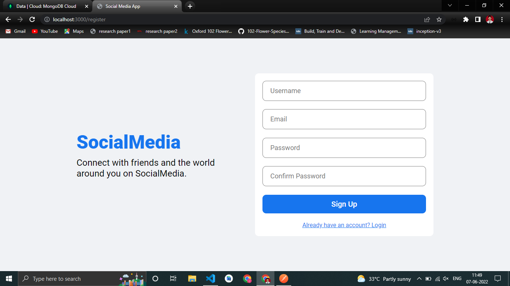
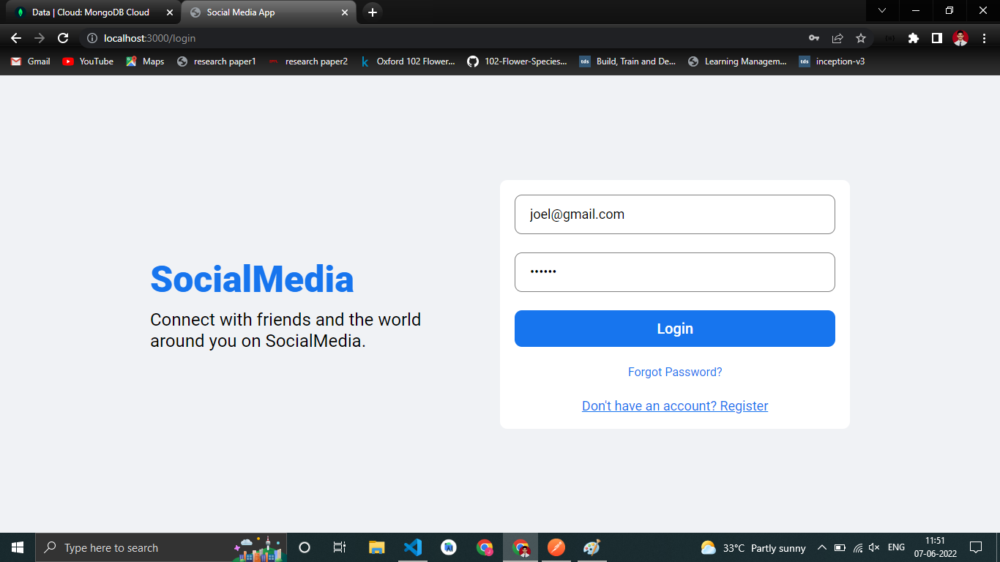
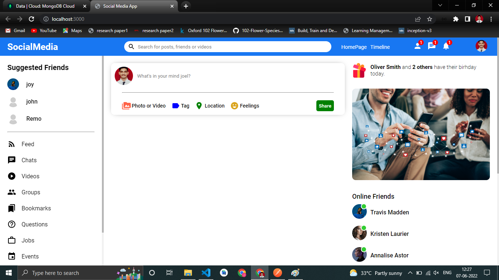
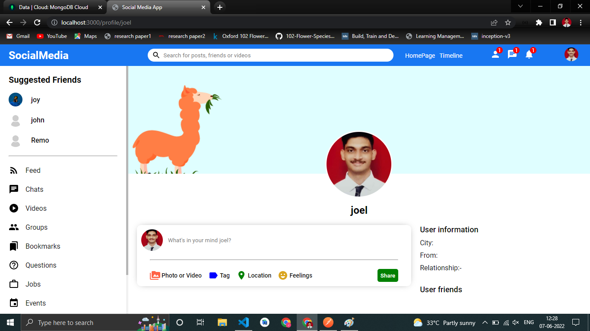
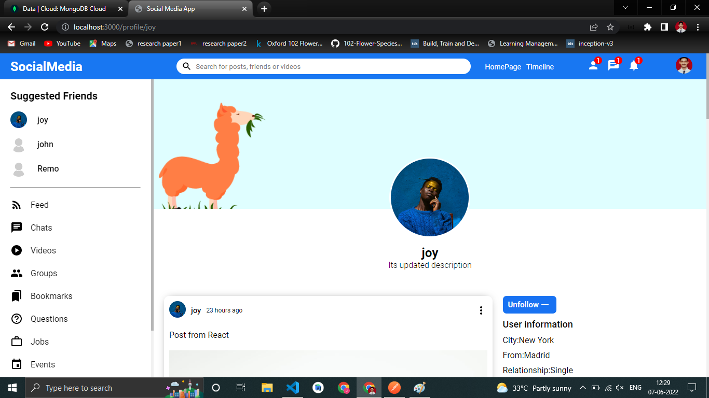
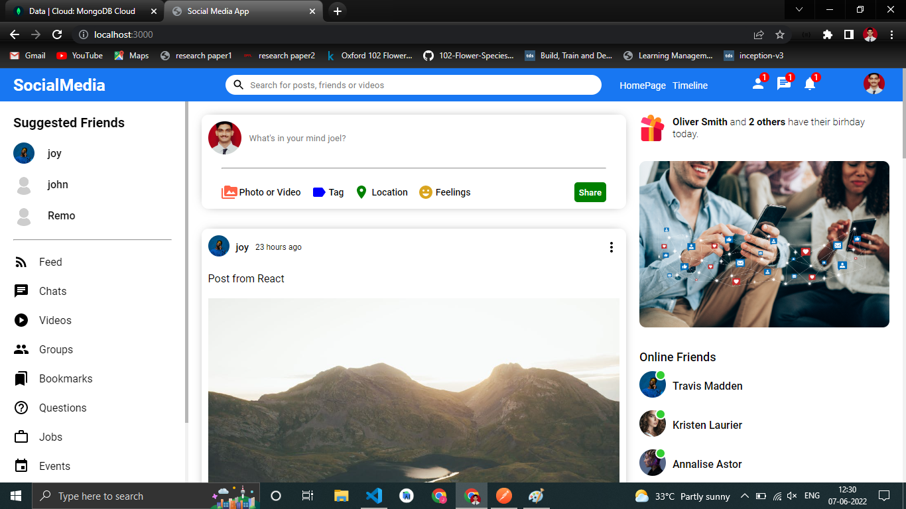
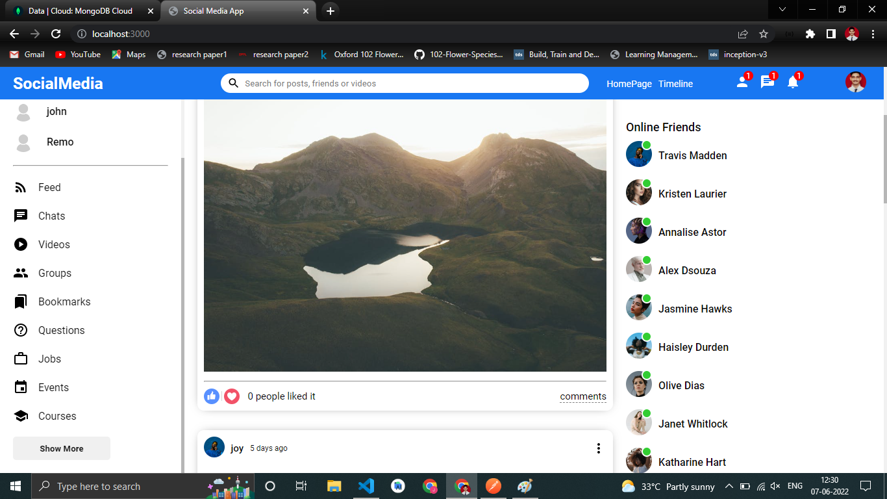

# MERN-Social-Media (Website Preview) :-
A fullstack Social Media website which is build using MERN(Mongodb, Express.js, React.js and Node.js).

First a REST-API was developed using Express, Nodejs and Mongodb and was integrated within the React project. 

The website has functionality for users to login/register, follow another user, create posts and like others posts.

## Signup page

## Login page

## Home page

## Your Profile Page

## Friend's Profile Page

## Follow a Friend

## Dynamic Posts On Feed

